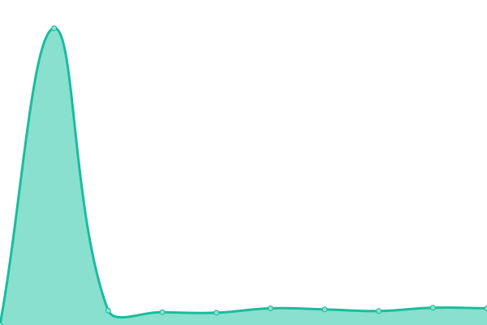

# [📈 Live Status](https://upptime.github.io/upptime): <!--live status--> **🟩 All systems operational**

This repository contains the open-source uptime monitor and status page for [Upptime](https://upptime.js.org), powered by [Upptime](https://github.com/upptime/upptime).

With [Upptime](https://upptime.js.org), you can get your own unlimited and free uptime monitor and status page, powered entirely by a GitHub repository. We use [Issues](https://github.com/upptime/upptime/issues) as incident reports, [Actions](https://github.com/foneazmi/status/actions) as uptime monitors, and [Pages](https://upptime.github.io/upptime) for the status page.

<!--start: status pages-->
<!-- This summary is generated by Upptime (https://github.com/upptime/upptime) -->
<!-- Do not edit this manually, your changes will be overwritten -->
<!-- prettier-ignore -->
| URL | Status | History | Response Time | Uptime |
| --- | ------ | ------- | ------------- | ------ |
|  [Web Khan](https://khan.my.id) | 🟩 Up | [web-khan.yml](https://github.com/foneazmi/status/commits/HEAD/history/web-khan.yml) | 

 1020ms
     
 | 

<a href="https://foneazmi.github.io/status/history/web-khan">99.83%</a>
    

|  [Api Khan](https://api.khan.my.id) | 🟩 Up | [api-khan.yml](https://github.com/foneazmi/status/commits/HEAD/history/api-khan.yml) | 

 913ms
     
 | 

<a href="https://foneazmi.github.io/status/history/api-khan">99.84%</a>
    

|  [Pocket Base](https://pb.khan.my.id/api/health) | 🟩 Up | [pocket-base.yml](https://github.com/foneazmi/status/commits/HEAD/history/pocket-base.yml) | 

 929ms
     
 | 

<a href="https://foneazmi.github.io/status/history/pocket-base">99.86%</a>
    

|  [File Khan](https://file.khan.my.id) | 🟩 Up | [file-khan.yml](https://github.com/foneazmi/status/commits/HEAD/history/file-khan.yml) | 

 864ms
     
 | 

<a href="https://foneazmi.github.io/status/history/file-khan">99.87%</a>
    

<!--end: status pages-->

[**Visit our status website →**](https://upptime.github.io/upptime)

## 📄 License

- Powered by: [Upptime](https://github.com/upptime/upptime)
- Code: [MIT](./LICENSE) © [Upptime](https://upptime.js.org)
- Data in the `./history` directory: [Open Database License](https://opendatacommons.org/licenses/odbl/1-0/)
