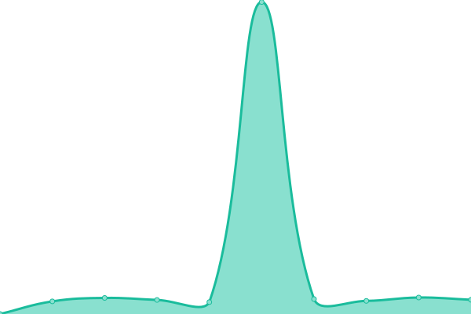
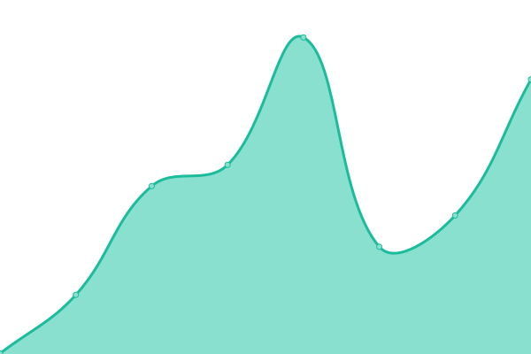

# [📈 Live Status](https://foneazmi.github.io): <!--live status--> **🟩 All systems operational**

This repository contains the open-source uptime monitor and status page for [Farkhan Azmi](khan.my.id), powered by [Upptime](https://github.com/upptime/upptime).

With [Upptime](https://upptime.js.org), you can get your own unlimited and free uptime monitor and status page, powered entirely by a GitHub repository. We use [Issues](https://github.com/foneazmi/status/issues) as incident reports, [Actions](https://github.com/foneazmi/status/actions) as uptime monitors, and [Pages](https://foneazmi.github.io) for the status page.

<!--start: status pages-->
<!-- This summary is generated by Upptime (https://github.com/upptime/upptime) -->
<!-- Do not edit this manually, your changes will be overwritten -->
<!-- prettier-ignore -->
| URL | Status | History | Response Time | Uptime |
| --- | ------ | ------- | ------------- | ------ |
|  [Khan](https://khan.my.id) | 🟩 Up | [khan.yml](https://github.com/foneazmi/status/commits/HEAD/history/khan.yml) | 

 255ms
     
 | 

<a href="https://status.khan.my.id/history/khan">100.00%</a>
    

|  [Api Khan](https://api.khan.my.id) | 🟩 Up | [api-khan.yml](https://github.com/foneazmi/status/commits/HEAD/history/api-khan.yml) | 

 4349ms
     
 | 

<a href="https://status.khan.my.id/history/api-khan">99.27%</a>
    

|  [Files](https://file.khan.my.id) | 🟩 Up | [files.yml](https://github.com/foneazmi/status/commits/HEAD/history/files.yml) | 

 2966ms
     
 | 

<a href="https://status.khan.my.id/history/files">99.28%</a>
    

|  [Stock](https://stock.khan.my.id) | 🟩 Up | [stock.yml](https://github.com/foneazmi/status/commits/HEAD/history/stock.yml) | 

 323ms
     
 | 

<a href="https://status.khan.my.id/history/stock">100.00%</a>
    

|  [Bookkeeping](https://ez.khan.my.id) | 🟩 Up | [bookkeeping.yml](https://github.com/foneazmi/status/commits/HEAD/history/bookkeeping.yml) | 

 3010ms
     
 | 

<a href="https://status.khan.my.id/history/bookkeeping">99.29%</a>
    

|  Pocketbase | 🟩 Up | [pocketbase.yml](https://github.com/foneazmi/status/commits/HEAD/history/pocketbase.yml) | 

 4600ms
     
 | 

<a href="https://status.khan.my.id/history/pocketbase">99.29%</a>
    

<!--end: status pages-->

[**Visit our status website →**](https://foneazmi.github.io)

## 📄 License

- Powered by: [Upptime](https://github.com/upptime/upptime)
- Code: [MIT](./LICENSE) © [Anand Chowdhary](https://anandchowdhary.com), supported by [Pabio](https://pabio.com)
- Data in the `./history` directory: [Open Database License](https://opendatacommons.org/licenses/odbl/1-0/)
